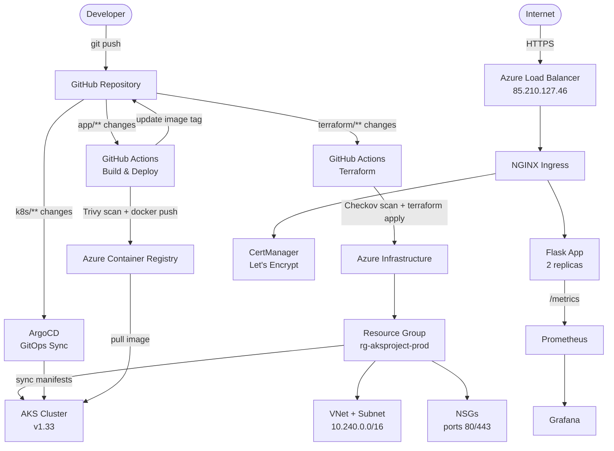

# AKS Cloud Native Project

A production-grade cloud-native application deployed on Azure Kubernetes Service (AKS), demonstrating end-to-end infrastructure provisioning, CI/CD automation, GitOps, and observability.

**Live:** https://aks.85-210-127-46.sslip.io

---

## Architecture



---

## Stack

| Layer | Technology |
|---|---|
| Cloud | Microsoft Azure |
| Kubernetes | AKS v1.33 |
| Container Registry | Azure Container Registry |
| Infrastructure as Code | Terraform (modular) |
| Terraform State | Azure Blob Storage |
| Ingress | NGINX Ingress Controller |
| TLS | CertManager + Let's Encrypt |
| GitOps | ArgoCD |
| CI/CD | GitHub Actions |
| Security Scanning | Checkov (Terraform) + Trivy (Docker) |
| Monitoring | Prometheus + Grafana |
| App | Flask + Gunicorn + Prometheus client |

---

## Repository Structure

```
.
├── app/
│   ├── app.py                    # Flask app with Prometheus metrics
│   ├── Dockerfile                # Multi-stage, non-root user
│   ├── requirements.txt
│   └── templates/index.html
├── terraform/
│   ├── main.tf                   # Root module
│   ├── variables.tf
│   ├── outputs.tf
│   ├── backend.tf                # Azure Blob remote state
│   ├── versions.tf
│   ├── terraform.tfvars.example
│   └── modules/
│       ├── resource-group/
│       ├── networking/           # VNet, subnet, NSGs
│       ├── acr/                  # Azure Container Registry
│       └── aks/                  # AKS cluster + AAD + ACR pull
├── k8s/
│   ├── deployment.yaml
│   ├── service.yaml
│   ├── ingress.yaml              # HTTPS via CertManager
│   ├── cluster-issuer.yaml       # Let's Encrypt ClusterIssuer
│   ├── servicemonitor.yaml       # Prometheus scraping
│   └── argocd-app.yaml          # ArgoCD Application
├── .github/workflows/
│   ├── docker-deploy.yml         # Build → Trivy → Push → Deploy
│   └── terraform.yml             # Checkov → Plan → Apply
└── scripts/
    └── bootstrap-state.sh        # One-time Terraform state setup
```

---

## How It Works

### 1. Infrastructure (Terraform)

All Azure resources are provisioned with reusable Terraform modules:

- **resource-group** — `rg-aksproject-prod`, contains all project resources
- **networking** — VNet (`10.0.0.0/8`), AKS subnet (`10.240.0.0/16`), NSGs allowing only ports 80/443 inbound
- **acr** — Azure Container Registry with a random suffix for global uniqueness; `admin_enabled = false`; AKS pulls via Managed Identity
- **aks** — Cluster with system-assigned identity, Azure CNI, AAD RBAC, OIDC Workload Identity, auto-scaling (1–3 nodes on `Standard_D2pds_v6`)

Remote state is stored in Azure Blob Storage (`rg-tfstate`) with versioning enabled for rollback.

### 2. CI/CD Pipelines (GitHub Actions)

**Terraform Pipeline** — triggers on `terraform/**` changes:
1. Checkov security scan
2. `terraform plan` on all PRs
3. `terraform apply` on merge to `main`

**Docker Pipeline** — triggers on `app/**` changes:
1. Build Docker image tagged with git SHA
2. Trivy scan — blocks on unfixed CRITICAL CVEs
3. Push to ACR
4. Update `k8s/deployment.yaml` with new image tag and commit back → ArgoCD picks it up

### 3. GitOps (ArgoCD)

ArgoCD watches the `k8s/` directory with `automated` sync policy (`prune: true`, `selfHeal: true`). Any manifest change pushed to `main` is automatically applied to the cluster within 3 minutes — no manual `kubectl apply` needed.

### 4. TLS (CertManager)

CertManager issues a real Let's Encrypt certificate via the HTTP-01 challenge through NGINX Ingress. The cert auto-renews before expiry.

### 5. Monitoring (Prometheus + Grafana)

- `kube-prometheus-stack` scrapes cluster metrics (nodes, pods, kubelet, CoreDNS)
- A `ServiceMonitor` points Prometheus at the Flask app's `/metrics` endpoint
- Grafana visualises both cluster and app metrics

---

## Deploying from Scratch

### Prerequisites

```bash
az version          # Azure CLI >= 2.50
terraform version   # >= 1.5.0
docker version
kubectl version --client
kubelogin --version
helm version
```

### Steps

**1. Bootstrap Terraform state (one-time)**
```bash
bash scripts/bootstrap-state.sh
# Update terraform/backend.tf with the printed storage account name
```

**2. Provision infrastructure**
```bash
cd terraform
cp terraform.tfvars.example terraform.tfvars
# Set subscription_id in terraform.tfvars
terraform init
terraform apply
```

**3. Connect kubectl**
```bash
az aks get-credentials --resource-group rg-aksproject-prod --name aks-aksproject-prod
kubelogin convert-kubeconfig -l azurecli
kubectl get nodes
```

**4. Install cluster components**
```bash
# NGINX Ingress
helm repo add ingress-nginx https://kubernetes.github.io/ingress-nginx
helm upgrade --install ingress-nginx ingress-nginx/ingress-nginx \
  --namespace ingress-nginx --create-namespace

# CertManager
helm repo add jetstack https://charts.jetstack.io
helm upgrade --install cert-manager jetstack/cert-manager \
  --namespace cert-manager --create-namespace --set crds.enabled=true

# ArgoCD
helm repo add argo https://argoproj.github.io/argo-helm
helm upgrade --install argocd argo/argo-cd \
  --namespace argocd --create-namespace

# Prometheus + Grafana
helm repo add prometheus-community https://prometheus-community.github.io/helm-charts
helm upgrade --install kube-prometheus-stack prometheus-community/kube-prometheus-stack \
  --namespace monitoring --create-namespace
```

**5. Deploy application via ArgoCD**
```bash
kubectl apply -f k8s/argocd-app.yaml
```

**6. Add GitHub Actions secrets**

| Secret | Value |
|---|---|
| `AZURE_CREDENTIALS` | Full JSON from `az ad sp create-for-rbac --sdk-auth` |
| `AZURE_CLIENT_ID` | Service principal client ID |
| `AZURE_CLIENT_SECRET` | Service principal client secret |
| `AZURE_SUBSCRIPTION_ID` | Azure subscription ID |
| `AZURE_TENANT_ID` | Azure tenant ID |

---

## Key Design Decisions

| Decision | Reason |
|---|---|
| Multi-stage Dockerfile | Smaller image, no build tools in production |
| Non-root container user | Limits blast radius if container is compromised |
| System-assigned Managed Identity | No credentials to rotate or leak |
| `AcrPull` via kubelet identity | Nodes pull images without stored secrets |
| Azure CNI (not kubenet) | Pods get real VNet IPs — better Azure integration |
| AAD RBAC on AKS | Cluster access managed via Azure roles, not kubeconfig sharing |
| sslip.io | Free wildcard DNS for HTTPS without a registered domain |
| ArgoCD auto-sync + self-heal | Cluster state always matches git — drift is auto-corrected |
| Trivy `ignore-unfixed` | Only fails on CVEs with available fixes — avoids blocking on OS-level unfixable vulns |

---

## Terraform Variables

| Variable | Default | Description |
|---|---|---|
| `subscription_id` | required | Azure subscription ID |
| `project_name` | `aksproject` | Used in resource names |
| `environment` | `prod` | Used in resource names |
| `location` | `uksouth` | Azure region |
| `kubernetes_version` | `1.33` | AKS Kubernetes version |
| `node_vm_size` | `Standard_D2pds_v6` | AKS node VM size |
| `min_node_count` | `1` | Autoscaler minimum |
| `max_node_count` | `3` | Autoscaler maximum |

---

## Azure Services Used

| Service | Purpose |
|---|---|
| AKS | Managed Kubernetes cluster |
| ACR | Container image registry |
| Azure VNet | Network isolation for cluster nodes |
| Azure NSG | Restrict inbound traffic to ports 80/443 |
| Azure Load Balancer | Public ingress endpoint |
| Azure Blob Storage | Terraform remote state |
| Azure Active Directory | AKS RBAC and Managed Identity |
